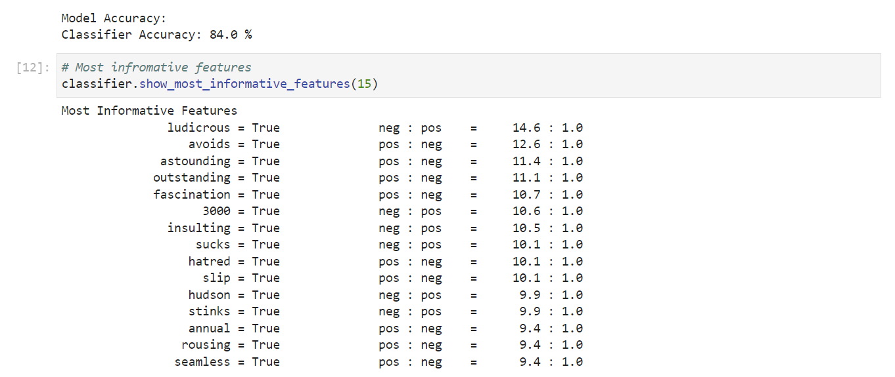

# NLTK Movie Reviews - Naive Bayes Classifier
 Warm up: I train a classifier using nltk corpus 'movie_reviews' and the Statistic Classifier 'Naive Bayes'

# Requirements

* Python
* NLTK
* Pickle

# How to execute

* python nltk_movie_review_naive_bayes_classifier.py

* Or use the 'nltk_movie_review_naive_bayes_classifier.ypynb' file in an editor or IDE that support jupyter notebook

# Results

